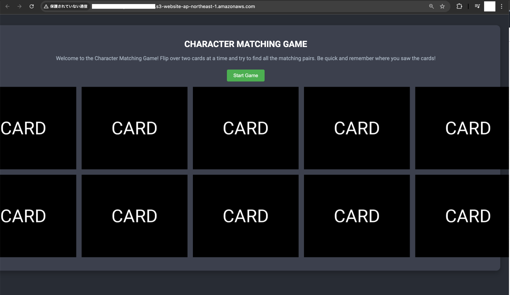

# Character Matching Game

## The Game
A simple memory matching game.  The user clicks two cards (images of characters) to try to match them.  If there's a match, the cards disappear from the board.  If there's no match, the cards are flipped back to their blank side so the user can try again.

The game consists of HTML, CSS and JavaScript.

## The Deployment Environment
The code can be deployed and hosted in S3.

## The Deployment Pipeline
The pipeline is created using AWS Code Pipeline.  The pipeline pulls the code from GitHub, and deploys it to S3 whenever a change is detected in the code.

## Demo
A demo video is available in the `src/` 

## AWS S3 Deployment Demo

